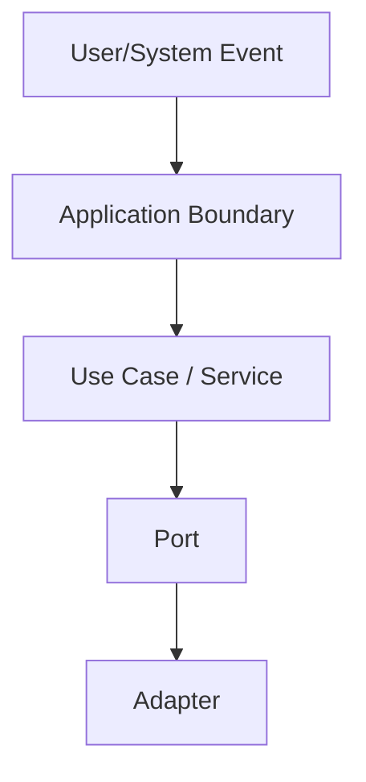

# Design

## Goal

Define **how** the approved spec will be built: architecture, components, interfaces, data, reuse, risks, and decisions.

Skip this phase only when the change is straightforward and has no architectural decision, no new pattern, and no meaningful component interaction.

## Required context

Before designing:

1. Read `.specs/features/[feature]/spec.md`.
2. Read `.specs/features/[feature]/context.md` if it exists.
3. Read `.specs/STATE.md` decisions section if it exists.
4. Load confirmed lessons if `.specs/lessons.json` exists.
5. Inspect nearby code and existing project conventions.

## Knowledge verification chain

```txt
Codebase -> Project docs -> Context7 MCP -> Web/official docs -> Flag uncertainty
```

Never invent APIs, commands, patterns, or library behavior.

## Design process

1. Confirm the feature boundary from the spec.
2. Identify existing code to reuse.
3. For large/complex features, compare 2-3 viable approaches and recommend one.
4. Define components, interfaces, dependencies, and data models.
5. Define error handling and state behavior.
6. Record non-obvious decisions.
7. Flag risks and mitigations.

## Project-level decisions

If a decision becomes a convention for future features, append it to `.specs/STATE.md` under `## Decisions` as the next `AD-NNN` entry.

Feature-local decisions stay in `design.md` only.

## Output: `.specs/features/[feature]/design.md`

```markdown
# [Feature] Design

**Spec:** `.specs/features/[feature]/spec.md`
**Status:** Draft | Approved

## Architecture Overview

[Recommended approach and why.]



## Code Reuse Analysis

| Existing component | Location | How to use |
| --- | --- | --- |
| [Component] | `path` | [Reuse/extend/follow pattern] |

## Components

### [Component]

- **Purpose:** [one sentence]
- **Location:** `path`
- **Interfaces:** [methods/contracts]
- **Dependencies:** [ports/adapters/services]
- **Reuses:** [existing code]

## Data Models

[Models, fields, relationships, invariants, migrations if applicable.]

## Error Handling Strategy

| Error | Handling | User/API impact |
| --- | --- | --- |
| [Scenario] | [Behavior] | [Impact] |

## Risks & Concerns

| Concern | Location | Impact | Mitigation |
| --- | --- | --- | --- |
| [Risk] | `file:line` | [Impact] | [Mitigation] |

## Tech Decisions

| Decision | Choice | Rationale | Scope |
| --- | --- | --- | --- |
| [Decision] | [Choice] | [Reason] | feature/project |
```

## Approval gate

Do not break into tasks until the design is internally consistent, aligned with active decisions, and either approved or explicitly marked as an assumption.
